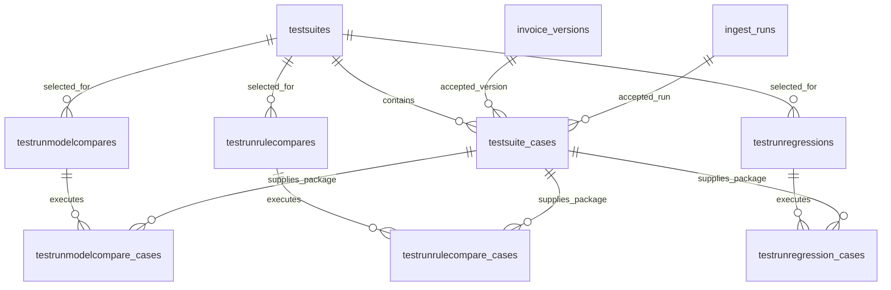

# Claims AI Test Harness Plan

## 1. Decision Summary

Build one test-harness subsystem with three distinct modes:

1. **Model comparison** — hold the package and rules constant while comparing independently selected models for document classification, supporting-document extraction, and upgrade analysis.
2. **Rule comparison** — hold the package and models constant while comparing one historical GenAI rule definition with its current candidate definition.
3. **Regression** — process a suite of packages through the complete pipeline to detect crashes, failed steps, missing outputs, and other broad stability problems before a release.

All three modes are now in scope. The executable schema consists of eight harness tables:

- `claims.testsuites`
- `claims.testsuite_cases`
- `claims.testrunmodelcompares`
- `claims.testrunmodelcompare_cases`
- `claims.testrunrulecompares`
- `claims.testrunrulecompare_cases`
- `claims.testrunregressions`
- `claims.testrunregression_cases`

The three modes share suites and source packages, but each has its own run table, case table, workflow, and user experience. This keeps the screens understandable and avoids a generic run table full of mode-dependent nullable columns.

## 2. Source of Truth and Scope Boundary

The database source of truth is:

- `claims_ai_service_ddl/2_create_schema.sql` for normal application tables, model-deployment configuration, and immutable ingest-run deployment snapshots.
- `claims_ai_service_ddl/2_create_schema_for_testharness.sql` for all eight executable harness tables.

The harness script runs immediately after the main schema script. It contains no executable `ALTER TABLE` statements and must remain idempotent.

### In scope

- Reusable test suites composed of existing invoice versions and their exact ingest runs.
- Full CRUD for suites and suite cases.
- The existing System Config screen extended with an **AI Models** tab.
- Model-comparison submission, execution, finalization, history, and results.
- Single-rule comparison submission, execution, finalization, history, and results.
- Full-pipeline regression submission, execution, history, and results.
- Fresh package replay using the source files already persisted in Azure-backed application records.
- Immutable run configuration, authorization, controlled failures, and automated tests.
- A separate screen family for each harness mode.

### Not in scope

- Mounted workstation, local-drive, or LAN test-data folders.
- A separate model registry table or provider deployment discovery.
- Provider endpoints, credentials, or tokens stored in PostgreSQL.
- Model-specific environment variables for the three business calls.
- JSON columns in harness tables.
- A normalized child table for each comparison LLM call.
- A separate regression-expectations table.
- Creating or uploading baseline packages from inside the harness.
- Mutating accepted baseline invoice versions.
- General edit or delete actions for submitted run records.

## 3. Core Business Concepts

### Test suite

A reusable business grouping of representative invoice packages. The unique suite `name` is its business identifier. A suite is reusable across all three harness modes.

### Suite case

One existing, successfully processed invoice version selected for reuse by the harness. It records:

- `baseline_invoice_version_id`
- `baseline_ingest_run_id`
- A case name and optional description.

The invoice version and ingest run identify the exact accepted package, its persisted evidence, its Azure-backed source files, and the three business deployments used when it was processed.

The word `baseline` on this shared table means “the accepted source package.” Regression does not perform a baseline/candidate comparison; it uses the suite case only as the package to replay.

### Model-comparison run and case

The parent freezes three derived baseline deployments, three selected candidate deployments, the evaluator deployment, and three suite-wide analyses. Each case records the exact baseline package, one fresh candidate execution, three case-level analyses, status, and controlled failure code.

### Rule-comparison run and case

The parent identifies one historical rule definition, the current candidate rule belonging to the same logical rule, the evaluator deployment, and one suite-wide analysis. Each case records one fresh candidate execution and one readable comparison of the selected rule's baseline and candidate results.

### Regression run and case

The parent freezes the three deployments used for the release check. Each case processes one source package exactly once and records the generated invoice version, ingest run, status, controlled failure code, and a readable result summary. There are no baseline and candidate execution columns because regression is a pipeline-stability run, not a comparison run.

## 4. Data Model



### 4.1 `testsuites`

Purpose: reusable grouping of accepted packages.

Fields:

- `id`
- `name`
- `description`
- timestamps

Rules:

- `name` is required, nonblank, and globally unique.
- There is intentionally no suite key, enabled flag, or created-by field.
- Deleting a suite cascades to suite cases only when no run parent restricts deletion.

### 4.2 `testsuite_cases`

Purpose: one accepted package within a suite.

Fields:

- `id`
- `testsuite_id`
- `baseline_invoice_version_id`
- `baseline_ingest_run_id`
- `name`
- `description`
- timestamps

Rules:

- A case name is unique within its suite.
- An invoice version can occur only once within a suite but may appear in different suites.
- The application verifies that the ingest run produced the selected invoice version.
- Referenced invoice versions and ingest runs cannot be deleted.
- The composite unique key supports comparison-case foreign keys and prevents baseline substitution.

### 4.3 `testrunmodelcompares`

Purpose: one validated model-comparison definition and execution.

Configuration:

- `testsuite_id`
- `status`
- Three `baseline_*_deployment_name` fields.
- Three `candidate_*_deployment_name` fields.
- `comparison_deployment_name`

Final analyses:

- `overall_document_classification_comparison`
- `overall_supporting_document_extraction_comparison`
- `overall_upgrade_analysis_comparison`

Rules:

- All seven deployment fields are required and nonblank.
- Baseline deployments are derived from every suite case's exact ingest run.
- Every case must have the same three baseline deployments.
- Parent creation fails if the suite is empty, provenance is missing, or deployments differ.
- No execution cases are created while the parent is merely being created as a draft.
- A completed run requires all three overall analyses.

### 4.4 `testrunmodelcompare_cases`

Purpose: one actual package execution created when a model-comparison run begins.

Fields:

- Parent run and suite-case IDs.
- Exact baseline invoice-version and ingest-run IDs.
- Fresh candidate invoice-version and ingest-run IDs.
- Three case-level comparison texts.
- `status`, `failure_code`, and timestamps.

Rules:

- One row exists per suite case per run.
- The composite foreign key guarantees that copied baseline IDs match the suite case.
- Candidate IDs are null until the fresh package execution exists.
- Candidate and baseline invoice versions must differ.
- A failed row requires one controlled failure code; a nonfailed row cannot have one.
- The three comparison outputs stay on this row because one package is rerun as a unit.

### 4.5 `testrunrulecompares`

Purpose: one validated comparison of two definitions of the same logical GenAI rule.

Fields:

- `testsuite_id`
- `baseline_genai_rule_history_id`
- `candidate_genai_rule_id`
- `comparison_deployment_name`
- `overall_rule_comparison`
- `status` and timestamps

Rules:

- The baseline history row is immutable historical content.
- The candidate ID points to the current rule registry row.
- The history row's `source_id` must equal the candidate rule ID.
- Every suite invoice version must contain at least one rulecheck for the selected logical rule.
- The frozen baseline step context must prove that the selected historical definition produced the baseline behavior.
- The candidate rule and evaluator deployment are revalidated when the draft is submitted.
- A completed run requires a nonblank overall comparison.

The logical-rule and compiled-prompt checks cross normal application tables and therefore belong in transactional application preflight rather than a row-level SQL check constraint.

### 4.6 `testrunrulecompare_cases`

Purpose: one package execution for the selected changed rule.

Fields:

- Parent run and suite-case IDs.
- Exact baseline invoice-version and ingest-run IDs.
- Fresh candidate invoice-version and ingest-run IDs.
- `rule_comparison`.
- `status`, `failure_code`, and timestamps.

Rules:

- One row exists per suite case per run.
- Copied baseline IDs must match the selected suite case.
- Candidate and baseline invoice versions must differ.
- One case-level evaluator call writes the readable rule comparison.
- The same controlled failure and status-shape rules used by model-comparison cases apply.

### 4.7 `testrunregressions`

Purpose: one full-pipeline release-regression run.

Fields:

- `testsuite_id`
- `status`
- `document_triage_deployment_name`
- `supporting_document_extraction_deployment_name`
- `upgrade_analysis_deployment_name`
- timestamps

Rules:

- All three deployment fields are required and nonblank.
- The selected values are frozen on the parent and copied to every generated ingest run.
- Regression has no evaluator deployment because it is not an LLM comparison workflow.
- Parent status is derived from the terminal state of all its cases.

### 4.8 `testrunregression_cases`

Purpose: one complete pipeline execution for one suite case.

Fields:

- Parent run and suite-case IDs.
- Generated `invoice_version_id` and `ingest_run_id`.
- `result_summary`.
- `status`, `failure_code`, and timestamps.

Rules:

- One row exists per suite case per regression run.
- There are no baseline/candidate execution pairs.
- A completed case must identify its generated invoice version and ingest run.
- A failed case requires one controlled failure code; a nonfailed case cannot have one.
- The result summary records the broad checks performed and notable outcomes without duplicating normal application evidence.

## 5. Status and Failure Vocabulary

Parent statuses for all three modes:

- `draft`
- `queued`
- `running`
- `completed`
- `failed`
- `cancelled`

Case statuses for all three modes:

- `queued`
- `running`
- `completed`
- `failed`
- `skipped`
- `cancelled`

Model- and rule-comparison case failure codes:

- `baseline_unavailable`
- `configuration_invalid`
- `candidate_run_creation_failed`
- `candidate_processing_failed`
- `comparison_failed`
- `internal_error`

Regression case failure codes:

- `source_unavailable`
- `configuration_invalid`
- `ingest_run_creation_failed`
- `processing_failed`
- `internal_error`

## 6. Model Configuration and Runtime Contract

### System Config

The main schema stores four nonsecret deployment names on `claims.validationgenai_config`:

- `document_triage_deployment_name`
- `supporting_document_extraction_deployment_name`
- `upgrade_analysis_deployment_name`
- `comparison_deployment_name`

Add an **AI Models** tab to the existing System Config screen. Provider endpoints and secrets remain in environment/OpenShift configuration.

### Ingest-run snapshots

Every normal ingest run freezes the three current business deployment names on `claims.ingest_runs`. Every business GenAI call reads its run snapshot rather than live System Config.

Harness behavior:

- Model comparison copies the parent's three candidate deployments to each candidate ingest run.
- Rule comparison copies each baseline case's three deployment snapshots to its candidate ingest run, ensuring that only the rule definition changes.
- Regression copies the regression parent's three deployments to each generated ingest run.
- Comparison deployment names are not copied to ingest runs because evaluator calls are harness work, not invoice-processing steps.

### Node service contract

Keep `GENAI_BASE_URL` and `GENAI_KEY` in environment/OpenShift secrets. Do not add one environment variable per model.

Rails selects a deployment server-side and sends `deployment_name` to the Node GenAI service. The DTO validates it, and the provider adapter uses it for both Responses API and Chat Completions styles. Keep `GENAI_DEPLOYMENT` only as a temporary rollout fallback and for unrelated simple-chat behavior.

| GenAI activity                   | Deployment source                                            |
| -------------------------------- | ------------------------------------------------------------ |
| Document triage/classification   | `ingest_runs.document_triage_deployment_name`                |
| Supporting-document extraction   | `ingest_runs.supporting_document_extraction_deployment_name` |
| Upgrade analysis and GenAI rules | `ingest_runs.upgrade_analysis_deployment_name`               |
| Model-comparison evaluation      | `testrunmodelcompares.comparison_deployment_name`            |
| Rule-comparison evaluation       | `testrunrulecompares.comparison_deployment_name`             |

## 7. Shared Suite Workflow

1. Process representative packages through the normal application.
2. Review each successful invoice version and decide whether it is suitable for reuse.
3. Create or select a suite.
4. Add the existing invoice version and exact producing ingest run as a suite case.
5. Give the case a short business name and optional description.

No local folder or mount is involved. Harness replay reconstructs the package from persisted application records and Azure storage references.

Draft run creation never creates child rows. Starting any run revalidates the suite, then creates one execution case for every current suite case. Execution cases are run output, not suite snapshots created with the parent.

## 8. Model-Comparison Workflow

### Create and validate

1. Select a suite, three candidate deployments, and the evaluator deployment.
2. Confirm every suite case's invoice-version/ingest-run relationship.
3. Confirm all three baseline deployment snapshots are populated and identical across the suite.
4. Copy the derived baseline deployments and selected candidate deployments to a draft parent.
5. Revalidate under a lock or equivalent transaction boundary when the draft is submitted.

### Execute and compare

1. Create one model-comparison case per suite case.
2. Reconstruct each source package and create a fresh candidate invoice version and ingest run.
3. Process it through the real pipeline using the parent candidate deployments.
4. Perform three evaluator calls: classification, supporting-document extraction, and upgrade analysis.
5. Store the three readable analyses on the case only after all three calls succeed.
6. After every case is terminal, perform one finalization call and store three suite-wide analyses.
7. Complete the parent only when every case completed and all three overall fields are nonblank.

One failed case does not stop remaining cases from reaching a terminal state.

## 9. Rule-Comparison Workflow

### Create and validate

1. Select a suite, one historical rule definition, its current candidate rule, and the evaluator deployment.
2. Confirm `genai_rule_history.source_id` equals the candidate `genai_rules.id`.
3. Confirm every suite invoice version used that logical rule at least once.
4. Confirm each baseline ingest-step context contains the selected historical definition.
5. Confirm each baseline ingest run contains all three model snapshots.
6. Create the draft parent without child rows.
7. Revalidate the suite and candidate definition when submitted.

### Execute and compare

1. Create one rule-comparison case per suite case and copy its exact baseline IDs.
2. Reconstruct each package and create a fresh candidate invoice version and ingest run.
3. Copy that case's baseline deployments to the candidate run so the models remain unchanged.
4. Execute the candidate using an isolated per-run override of the selected candidate rule; do not globally publish or mutate rule configuration as part of harness execution.
5. Compare the selected baseline and candidate rule results with one evaluator call.
6. Store one readable case comparison.
7. After all cases complete, perform one finalization call and store `overall_rule_comparison`.

The normal invoice-version, rulecheck, and ingest-step tables remain the source of detailed evidence. Do not add rule-history provenance to `invoice_version_rulechecks` merely for the harness.

## 10. Regression Workflow

### Create and execute

1. Select a suite and the three business deployments to validate for the release.
2. Create a draft regression parent without case rows.
3. Revalidate the suite when submitted and create one regression case per suite case.
4. Reconstruct every package and process it once through the complete real pipeline using the frozen parent deployments.
5. Record the generated invoice version and ingest run.
6. Evaluate deterministic broad-health checks, including pipeline completion, required step completion, expected core records, and absence of unhandled processing failures.
7. Write a concise `result_summary` and terminal case status.
8. Complete the parent only when every case completes; otherwise allow all cases to settle and mark the parent failed.

Regression deliberately does not use comparison LLM calls or baseline/candidate terminology. More granular business expectations can be added to the case design later if experience proves that broad release checks are insufficient; no separate expectations table is planned.

## 11. Screens

```text
System Config
  AI Models

Test Harness
  Test Suites
    Suite Cases

  Model Comparisons
    New Model Comparison
    Model Comparison Detail
      Case Results

  Rule Comparisons
    New Rule Comparison
    Rule Comparison Detail
      Case Results

  Regression Runs
    New Regression Run
    Regression Run Detail
      Case Results
```

### Test Suites and Suite Cases

- Full CRUD for suite name/description and suite-case membership.
- Add only existing successfully processed invoice versions.
- Resolve and validate the exact producing ingest run.
- Show invoice/version identity, processing deployments, and links to normal inspection screens.
- Disable suite deletion when any harness run references it.

### Model Comparisons

- Grid: read-only history filtered by suite and status.
- New screen: suite, derived baseline deployments, three candidate deployments, evaluator deployment, preflight, draft, and explicit run action.
- Detail: configuration, status/progress, three overall analyses, and combined expandable case results.

### Rule Comparisons

- Grid: read-only history filtered by suite, rule, and status.
- New screen: suite, historical baseline rule, current candidate rule, evaluator deployment, preflight, draft, and explicit run action.
- Detail: rule definitions, provenance validation, status/progress, overall analysis, and combined expandable case results.

### Regression Runs

- Grid: read-only history filtered by suite and status.
- New screen: suite, three deployment selections, case count, draft, and explicit run action.
- Detail: configuration, progress, failures, generated invoice/run links, and expandable result summaries.

Each mode owns a separate screen family. Case execution and results are combined on the parent detail screen rather than exposed as independent CRUD grids.

## 12. Application Components

### Rails models

Add eight models with explicit table names and associations:

- `Claims::TestSuite`
- `Claims::TestSuiteCase`
- `Claims::TestRunModelCompare`
- `Claims::TestRunModelCompareCase`
- `Claims::TestRunRuleCompare`
- `Claims::TestRunRuleCompareCase`
- `Claims::TestRunRegression`
- `Claims::TestRunRegressionCase`

### APIs and services

Add authorized endpoints and services for:

- Suite and suite-case CRUD.
- Eligible invoice-version and ingest-run lookup.
- Preflight, draft creation, submission, history, and detail for each mode.
- Package reconstruction and fresh pipeline execution.
- Model-comparison evidence assembly and finalization.
- Rule-definition validation, isolated rule override, comparison evidence assembly, and finalization.
- Regression health checks and result summaries.

All harness endpoints require the existing `claims.test_tools` authorization. The browser never sends an unchecked deployment directly to Node.

### Background jobs

Use a parent orchestration job and per-case jobs for each mode:

- Parent jobs create missing case rows idempotently and monitor terminal state.
- Case jobs process one complete package.
- Comparison finalization jobs run only after every applicable case completes.
- Concurrency is bounded to protect provider quotas and normal application work.
- Status boundaries prevent duplicate invoice versions, ingest runs, and evaluator calls.

## 13. Integrity and Operational Rules

- Normal application tables remain the evidence source of truth.
- Harness tables store references, run configuration, state, failure codes, and readable summaries only.
- Every harness execution creates fresh invoice-version and ingest-run records; accepted suite records are never mutated.
- Run configuration is frozen and never reread from mutable System Config after submission.
- Suite membership cannot be silently substituted in comparison cases.
- Incompatible cases block parent creation or submission; they are not silently skipped.
- Failure state is distinct from comparison or summary text.
- Run and case records are read-only after submission.
- No normal GUI cleanup action deletes harness-generated application evidence.
- No local-drive dependency is introduced.

## 14. Implementation Sequence

1. Add the eight-table harness DDL to the normal rebuild sequence after `2_create_schema.sql`.
2. Verify the four System Config deployment columns and three ingest-run snapshot columns.
3. Extend the System Config API and build the AI Models tab.
4. Snapshot deployments whenever a normal ingest run is created.
5. Extend Rails-to-Node requests with server-selected `deployment_name`.
6. Build all eight Rails models and associations.
7. Build suite and suite-case APIs, validation, and screens.
8. Implement shared package reconstruction and safe fresh-run orchestration.
9. Build model-comparison preflight, jobs, evaluator calls, finalization, and screens.
10. Build isolated rule-override support, rule-comparison preflight, jobs, evaluator calls, finalization, and screens.
11. Build regression preflight, full-pipeline jobs, health checks, summaries, and screens.
12. Add authorization and audit-safe diagnostics across all modes.
13. Add database, model, service, job, request, Node-contract, and UI tests.
14. Run small local end-to-end suites for all three modes before increasing concurrency or suite size.

## 15. Verification Plan

### SQL verification

Use an isolated temporary PostgreSQL database:

1. Run `2_create_schema.sql` with `ON_ERROR_STOP=1`.
2. Run `2_create_schema_for_testharness.sql` with `ON_ERROR_STOP=1`.
3. Run the harness script a second time to prove idempotence.
4. Confirm exactly eight executable harness tables exist.
5. Inspect all primary keys, foreign keys, unique constraints, checks, and indexes.
6. Confirm invalid statuses, blank deployments, invalid failure shapes, baseline substitution, and incomplete completed parents are rejected.
7. Confirm suite deletion is restricted after any run parent references it.

### Automated application tests

Shared tests:

- System Config and ingest-run snapshot tests.
- Node deployment-selection contract tests.
- Suite and suite-case CRUD, provenance, authorization, and deletion tests.
- Idempotent orchestration and bounded-concurrency tests.

Model-comparison tests:

- Empty suite, missing provenance, and inconsistent baseline deployment preflight.
- Candidate execution with each selected deployment.
- Three case-level evaluator calls and one three-part finalization call.
- Controlled package and evaluator failures.

Rule-comparison tests:

- History/candidate logical-rule mismatch.
- Suite case missing the selected rule.
- Baseline compiled-prompt mismatch.
- Model deployments held constant between baseline and candidate.
- Isolated candidate-rule override without global configuration mutation.
- Case comparison and suite finalization failures.

Regression tests:

- One execution per suite case with no baseline/candidate pair.
- All three parent deployments copied to generated ingest runs.
- Required pipeline-step and core-record health checks.
- Controlled source, creation, processing, and internal failures.
- Parent completion/failure derived after every case settles.

### Local end-to-end tests

1. Create a small suite with two or three accepted packages.
2. Run an equivalent model comparison using the same models, then change one model and rerun.
3. Compare one historical rule with its current definition while proving models remain constant.
4. Run the suite in regression mode and inspect every generated application record and summary.
5. Force one controlled failure in each mode and confirm remaining cases settle normally.

## 16. Acceptance Criteria

### Shared foundation

- An authorized administrator can manage model names, suites, and suite cases.
- Every suite case points to one exact existing invoice version and producing ingest run.
- Every generated ingest run uses deployments frozen by its harness workflow.
- No mounted drive or secret stored in PostgreSQL is required.

### Model comparison

- The user can vary the three business models independently.
- Every successful case stores three readable comparisons.
- One finalization call stores three suite-wide comparisons.
- Baseline and candidate application records remain independently inspectable.

### Rule comparison

- The user can select two definitions of the same logical rule.
- Every suite package is proven to contain the selected baseline rule before the run is created.
- Candidate execution changes only the selected rule definition while preserving the baseline models.
- Every successful case and completed parent store a readable comparison.

### Regression

- The user can run an entire suite through the current pipeline and selected deployments.
- Every case records its generated invoice version, ingest run, status, and result summary.
- Crashes, failed steps, and missing required outputs produce controlled failures.
- Regression results use no baseline/candidate terminology or comparison LLM calls.

### Scope control

- All eight DDL tables are executable and idempotent.
- All three harness modes have their own screens and workflows.
- No JSON or separate expectation/comparison-result tables are introduced.
- Normal application evidence remains the source of truth.
